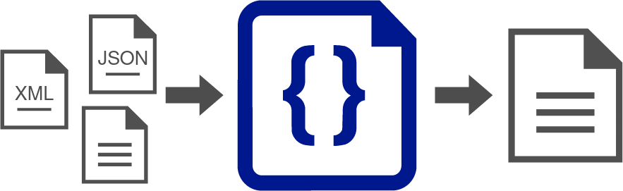

---
hide:
- navigation
- toc
---

# **_extensible jsonnet transformations_**

## xtrasonnet is an extensible, jsonnet-based, data transformation engine for Java or any JVM-based language. 

<br/>

<figure markdown>

</figure>

### xtrasonnet is an extension of databricks' [sjsonnet](https://github.com/databricks/sjsonnet), a Scala implementation of Google's [jsonnet](https://github.com/google/jsonnet). xtrasonnet enables extensibility, adds support for data formats other than JSON, and adds data transformation facilities through the `xtr` library and some additions to the jsonnet language itself.

<div class="container p-0">
    <div class="row">
        <div class="col-5 d-flex flex-column">
            ``` json
            {
                "message": "hello, world!"
            }
            ```
        </div>
        <div class="col-2 d-flex justify-content-center align-items-center">
            ➡
        </div>
        <div class="col-5">
            ``` jsonnet
            /** xtrasonnet
            input payload application/json
            output application/xml
            */
            {
                root: {
                    msg: payload.message,
                    at: xtr.datetime.now()
                }
            }
            ```
        </div>
    </div>
    <div class="row d-flex justify-content-center">
        ➡
    </div>
    <div class="row">
        <div class="col">
            ``` xml
            <?xml version='1.0' encoding='UTF-8'?>
            <root>
                <msg>hello, world!</msg>
                <at>2022-08-14T00:19:35.731362Z</at>
            </root>
            ```
        </div>
    </div>
</div>

## How extensible?
xtrasonnet has two points of extensibility:

* _Custom functions_: users can write native (e.g.: Java or Scala) functions as a `Library` and utilize them from their transformation code.
* _Any* data format_: users can write a custom `DataFormatPlugin` and transform from/to a given data format.

\* Any format that can be expressed as jsonnet elements.

## What kind of additions to the jsonnet language?
There are three main additions motivated to facilitate data transformation applications:


### Fluent syntax for infix macros (since 0.7.0)

This allows developers to write transformations in a more intuitive, fluent style by using infix notation for function calls.

For example, instead of `xtr.map(payload, function(...))`, you can write `payload xtr.map(function(...))`.

```jsonnet
local data = [1, 2, 3];
data xtr.map(function(it) it * 2)
```

⬇

```jsonnet
[2, 4, 6]
```

The infix syntax works with any function that takes at least one argument; the left-hand side becomes the first argument, and the right-hand side (if any) becomes the second argument. You can also chain multiple infix calls for more complex transformations.

For example, instead of
```jsonnet
xtr.map(
    xtr.filter(payload, function(...)), 
    function(...)
)
```

you can write:

```jsonnet
payload
    xtr.filter(function(it) ...)
    xtr.map(function(it) ...)
```


### Improved Numeric Semantics (since 0.7.0)

xtrasonnet provides improved numeric semantics to make computations more precise and deterministic, and safe for business calculations (e.g., financial or accounting logic).. Instead of representing all non-integer numbers as IEEE-754 doubles, the runtime supports three numeric representations:

* Int64 — exact 64-bit integers
* Float64 — IEEE-754 double precision (fast but inexact)
* Dec128 — decimal numbers using `BigDecimal` with `DECIMAL128` precision (34 digits)

By default:
* Floating-point literals are parsed as Dec128
* Arithmetic promotes values to the most precise representation
* Comparisons work safely across numeric types
* This avoids silent precision loss and produces predictable results.

```jsonnet
{
  precise: 0.1 + 0.2,
  largeNumber: 12345678901234567890,
}
```

⬇

```jsonnet
{
  precise: 0.3,
  largeNumber: 12345678901234567890
}
```

**Performance opt-out**

For performance-sensitive workloads, users may opt into Float64-based evaluation, which behaves closer to traditional JSON/JavaScript numeric semantics.


### Null-safe select `?.`
This allows developers to select, and chain, properties arbitrarily without testing existence.

```jsonnet
local myObj = {
    keyA: { first: { second: 'value' } },
    keyB: { first: { } }
};

{
    a: myObj?.keyA?.first?.second,
    b: myObj?.keyB?.first?.second,
    c: myObj?.keyC?.first?.second
}
```

⬇

```jsonnet
{
    a: 'value',
    b: null,
    c: null
}
```


### Null coalescing operator `??`
This allows developers to tersely test for `null` and provide a default value. For example

```jsonnet
local myObj = {
    keyA: { first: { second: 'value' } },
    keyB: { first: { } }
};

{
    a: myObj?.keyA?.first?.second,
    b: myObj?.keyB?.first?.second ?? 'defaultB',
    c: myObj?.keyC?.first?.second ?? 'defaultC'
}
```

⬇

```jsonnet
{
    a: 'value',
    b: 'defaultB',
    c: 'defaultC'
}
```
